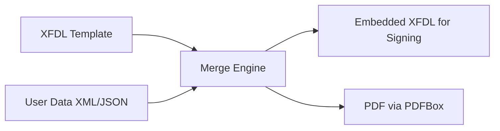

Great question — and the answer is: **Yes, XFDL supports both embedded and externalized data**, though the approach depends on your use case and the tools involved.

Let’s break it down clearly:

---

### ✅ **1. XFDL Can Store Data Internally (Default Behavior)**
In a typical **filled XFDL form**, the user’s data is **embedded directly in the XML** inside `<value>` tags:

```xml
<field sid="first_name">
  <value>Jane</value>
</field>
```

- This is the **standard, self-contained** XFDL format.
- The file is **portable**: all data + form definition in one file.
- Used by IBM Forms Viewer for saving, signing, and transmitting forms.

> ✅ **Pros**: Simple, atomic, tamper-evident (when signed).  
> ❌ **Cons**: Data isn’t easily reusable by other systems without parsing XML.

---

### ✅ **2. XFDL Also Supports Externalized (Linked) Data**
XFDL has a built-in mechanism to **reference external data sources** using the `<link>` element and **data binding**. This allows the form template to remain **static**, while data is pulled from an external file (e.g., XML, database, or web service).

#### 🔹 Example: XFDL Template with External Data Binding
```xml
<field sid="first_name">
  <value>
    <link>
      <uri>data.xml</uri>
      <xpath>/user/first_name</xpath>
    </link>
  </value>
</field>
```

Here:
- The XFDL file is a **template** (no hardcoded values).
- At runtime (in IBM Forms Viewer), it loads `data.xml` and populates the field using the XPath.

#### 🔹 External Data File (`data.xml`)
```xml
<user>
  <first_name>Jane</first_name>
  <last_name>Doe</last_name>
</user>
```

> ✅ **Pros**: Separation of form logic and data; easier integration with backend systems.  
> ❌ **Cons**: Requires a viewer that supports data linking (e.g., IBM Forms Viewer); not all tools honor `<link>`.

---

### 🔄 **3. Practical Reality: Most Systems Use Embedded Data**
Despite XFDL’s support for external data:
- **Government and defense workflows** (the main XFDL users) almost always use **self-contained XFDL files** for auditability, security, and offline use.
- **IBM Forms Viewer** can work with external data, but in practice, forms are **saved with data embedded** before submission.
- **Third-party tools** (including custom parsers) generally **expect data inside `<value>`**, not via `<link>`.

---

### 💡 **4. Best Practice for Modern Integration**
If you're building a system that **consumes XFDL data** (e.g., to fill PDFs), treat XFDL as a **data container** — **assume data is embedded**.

But if you control the **form generation pipeline**, you can:
- Keep a **clean XFDL template** (with no data)
- Store user data separately (e.g., in JSON or XML)
- **Merge them at runtime** (in your app) before processing

#### Example Workflow:


This gives you:
- Reusable templates
- Structured data for databases/APIs
- Flexibility to output to XFDL, PDF, HTML, etc.

---

### 🔧 How to Externalize Data in Practice (Without `<link>`)
Since `<link>` isn’t widely supported outside IBM ecosystems, a more robust approach is:

1. **Maintain two artifacts**:
   - `form_template.xfdl` → blank form (no `<value>` or empty `<value/>`)
   - `form_data.xml` → pure data (e.g., `<first_name>Jane</first_name>`)

2. **At runtime, inject data into XFDL** (using your own code):
   ```java
   // Pseudocode
   XfdlTemplate template = load("form_template.xfdl");
   Map<String, String> data = parse("form_data.xml");
   XfdlFilled = template.fill(data); // inject into <value> tags
   ```

3. Then use this filled XFDL to:
   - Display in viewer (if needed)
   - Extract data for PDF filling
   - Archive as signed submission

> This avoids reliance on XFDL’s `<link>` feature while achieving clean separation.

---

### 📌 Summary

| Approach | Data Location | Supported? | Recommended For |
|--------|----------------|-----------|------------------|
| **Embedded** | Inside XFDL (`<value>`) | ✅ Universal | Submissions, archival, signing |
| **External via `<link>`** | Separate file + XPath | ⚠️ IBM Forms only | Legacy IBM-centric workflows |
| **Logical separation (your code)** | Data in JSON/XML, merged at runtime | ✅ Fully controllable | Modern integrations, microservices |

---

### ✅ Recommendation
> **For interoperability and future-proofing:**
> - **Store user data externally** (e.g., in a database or structured file)
> - **Treat XFDL as a rendering/serialization format**, not a data store
> - **Embed data only when finalizing** a form for signature or submission

This way, you get the best of both worlds: clean architecture + compatibility with XFDL-based systems.

If you’d like a code example that **merges external JSON data into an XFDL template**, just say the word!